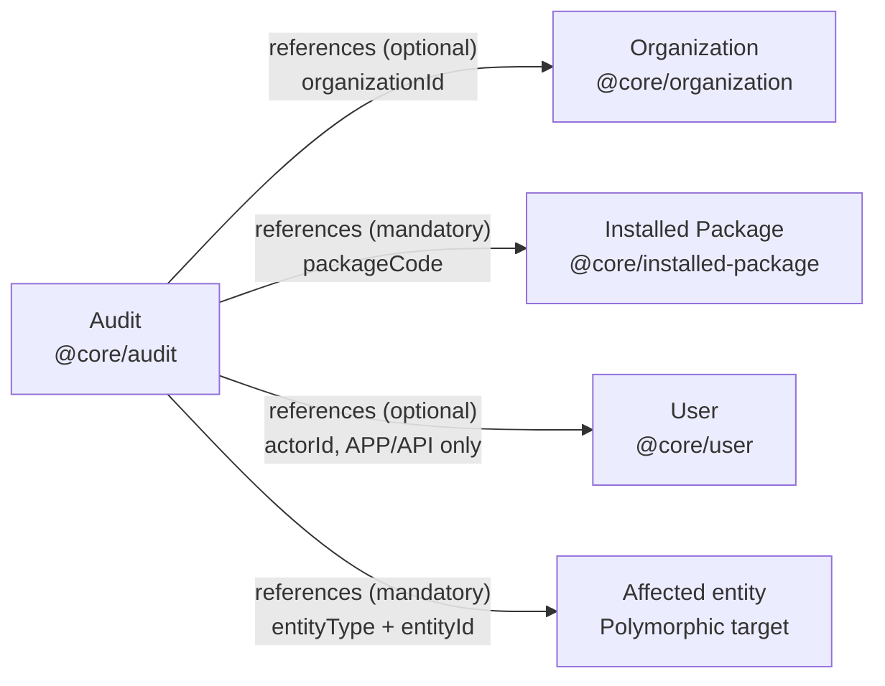

# Audit package documentation

**Package:** `@voyzu/audit`  


## Implements Semantic Contracts

### @core/audit

Read-only audit history. One contract returns the event header and its dependent field-change records.

#### Data definition and relationships

```ts
export type ActorType = "APP" | "API" | "SYSTEM";

export interface AuditChange {
  id: number;
  fieldPath: string;
  oldValue: unknown;
  newValue: unknown;
}

export interface Audit {
  id: number;
  code: string;
  packageCode: string;
  organizationId: number | null;
  organizationCode: string | null;
  actorType: ActorType | null;
  actorId: string | null;
  actorCode: string | null;
  actorDisplayName: string | null;
  action: string;
  entityType: string;
  entityId: string;
  entityCode: string | null;
  mutationId: string | null;
  creationDate: string;
  changes: AuditChange[];
}

export interface AuditRelationships {
  references: {
    organization: {
      contract: "@core/organization";
      source: "organizationId";
      participation: "optional";
    };

    package: {
      contract: "@core/installed-package";
      source: "packageCode";
      participation: "mandatory";
    };

    actor: {
      contract: "@core/user";
      source: "actorId";
      participation: "optional";
      when: {
        field: "actorType";
        in: readonly ["APP", "API"];
      };
    };

    entity: {
      contract: "*";
      source: {
        discriminator: "entityType";
        identifier: "entityId";
      };
      participation: "mandatory";
    };
  };
}

export interface AuditContract {
  identifier: "id";
  dataDefinition: Audit;
  relationships: AuditRelationships;
  methods: AuditMethods;
}
```

### Relationships Diagram



Arrows point from Audit to the referenced contract. Each target's `referencedBy` relationship is derived from the corresponding arrow. Audit declares no extends or composes relationships to other contracts.

#### Methods

```ts
export interface AuditFilters {
  packageCode?: string;
  organizationId?: number;
  entityType?: string;
  entityCode?: string;
  entityId?: string;
  mutationId?: string;
  actorId?: string;
  dateFrom?: string;
  dateTo?: string;
  search?: string;
}

export interface AuditPage {
  items: Audit[];
  nextCursor: string | null;
  totalMatching: number;
}

export interface AuditMethods {
  get(parameters: {
    id: number;
  }): Promise<Audit | null>;

  list(parameters: {
    filters?: AuditFilters;
    cursor?: string;
  }): Promise<AuditPage>;

  filter(parameters: {
    filters: AuditFilters;
    cursor?: string;
  }): Promise<AuditPage>;

  search(parameters: {
    q: string;
    filters?: AuditFilters;
    cursor?: string;
  }): Promise<AuditPage>;

  batchGet(parameters: {
    ids: number[];
  }): Promise<Audit[]>;

  count(parameters: {
    filters?: AuditFilters;
  }): Promise<{ count: number }>;

  export(parameters: {
    filters?: AuditFilters;
  }): Promise<Audit[]>;
}
```

### Semantic Contract to DTO mapping

| Semantic interface | DTO equivalent |
| --- | --- |
| `AuditChange` | `AuditChangeResponseDto`. |
| `Audit` | `AuditGetResponseDto` when non-null. HTTP `AuditEventResponseDto` differs by making `changes` optional. |
| `AuditFilters` | Used directly by `AuditEventFilterRequestDto`. |
| `AuditPage` | Corresponds to `AuditEventListResponseDto`, but contains semantic `Audit` objects instead of HTTP event DTOs. |
| `AuditMethods` | No single DTO; its method parameters and return values map to request/response DTOs. |
| `AuditContract` | No DTO; describes the contract itself, including identity, relationships and methods. |

`ActorType` is a shared value type rather than a standalone DTO.

## Persistence

### Create SQL

The installation SQL defines the tables and indexes. It requires the Foundation domains defined in [platform-domains.sql](../packages/@voyzu/foundation/install/db/sql/platform-domains.sql): `actor_type` permits `APP`, `API` or `SYSTEM`; `audit_timestamp` is a non-null `TIMESTAMPTZ` defaulting to `NOW()`.

[audit-event.sql](../packages/@voyzu/audit/install/db/sql/audit-event.sql)

```sql
CREATE TABLE IF NOT EXISTS audit_event (
    id BIGINT PRIMARY KEY GENERATED BY DEFAULT AS IDENTITY (START WITH 10000),
    code TEXT GENERATED ALWAYS AS ('AUDIT-' || id::TEXT) STORED,
    package_code TEXT NOT NULL CHECK (length(btrim(package_code)) > 0),
    organizationId BIGINT,
    actor_type actor_type,
    actor_id TEXT,
    action TEXT NOT NULL,
    entity_type TEXT NOT NULL,
    entity_id TEXT NOT NULL,
    entity_code TEXT,
    mutation_id TEXT,
    details_json JSONB,
    creation_date audit_timestamp
);

CREATE INDEX IF NOT EXISTS audit_event_package_organization_date_idx
    ON audit_event (package_code, organizationId, creation_date DESC, id DESC);

CREATE INDEX IF NOT EXISTS audit_event_package_entity_idx
    ON audit_event (package_code, entity_type, entity_id);

CREATE INDEX IF NOT EXISTS audit_event_mutation_idx
    ON audit_event (mutation_id);
```

[audit-change.sql](../packages/@voyzu/audit/install/db/sql/audit-change.sql)

```sql
CREATE TABLE IF NOT EXISTS audit_change (
    id BIGINT PRIMARY KEY GENERATED ALWAYS AS IDENTITY (START WITH 10000),
    audit_event_id BIGINT NOT NULL,
    field_path TEXT NOT NULL,
    old_value JSONB,
    new_value JSONB,

    CONSTRAINT fk_audit_event FOREIGN KEY (audit_event_id) REFERENCES audit_event(id),
    CONSTRAINT chk_value_present CHECK (old_value IS NOT NULL OR new_value IS NOT NULL)
);
```

### Trigger function

[audit-trigger.sql](../packages/@voyzu/audit/install/db/sql/audit-trigger.sql)

```sql
CREATE OR REPLACE FUNCTION audit_trigger_fn() RETURNS TRIGGER AS $$
DECLARE
  v_event_id    BIGINT;
  v_organizationId  BIGINT;
  v_entity_id   TEXT;
  v_entity_code TEXT;
  v_entity_code_field TEXT;
  v_action      TEXT;
  v_old_record  JSONB;
  v_new_record  JSONB;
  v_key         TEXT;
  v_old_value   JSONB;
  v_new_value   JSONB;
  v_entity_type TEXT;
  v_actor_type  TEXT;
  v_actor_id    TEXT;
  v_mutation_id TEXT;
  v_package_code TEXT;
BEGIN
  -- Prevent accidental recursion
  IF TG_TABLE_NAME IN ('audit_event', 'audit_change') THEN
    RETURN CASE WHEN TG_OP = 'DELETE' THEN OLD ELSE NEW END;
  END IF;

  IF TG_NARGS < 1 OR NULLIF(BTRIM(TG_ARGV[0]), '') IS NULL THEN
    RAISE EXCEPTION 'audit_trigger_fn requires a package code for %.%', TG_TABLE_SCHEMA, TG_TABLE_NAME;
  END IF;
  v_package_code := BTRIM(TG_ARGV[0]);
  v_entity_code_field := CASE
    WHEN TG_NARGS > 1 THEN COALESCE(NULLIF(BTRIM(TG_ARGV[1]), ''), 'code')
    ELSE 'code'
  END;

  v_action := TG_OP;

  IF TG_OP = 'INSERT' THEN
    NEW.creation_date := COALESCE(NEW.creation_date, NOW());
    NEW.creation_actor_type := COALESCE(NEW.creation_actor_type, 'SYSTEM'::actor_type);
    NEW.creation_mutation_id := COALESCE(NEW.creation_mutation_id, gen_random_uuid());
    NEW.updated_date := COALESCE(NEW.updated_date, NEW.creation_date);
    NEW.updated_actor_type := COALESCE(NEW.updated_actor_type, NEW.creation_actor_type);
    NEW.updated_user_id := COALESCE(NEW.updated_user_id, NEW.creation_user_id);
    NEW.updated_mutation_id := COALESCE(NEW.updated_mutation_id, NEW.creation_mutation_id);
  ELSIF TG_OP = 'UPDATE' THEN
    IF to_jsonb(NEW) - ARRAY[
      'creation_date','creation_actor_type','creation_user_id','creation_mutation_id',
      'updated_date','updated_actor_type','updated_user_id','updated_mutation_id',
      'deletion_date','deletion_actor_type','deletion_user_id','deletion_mutation_id'
    ] IS DISTINCT FROM to_jsonb(OLD) - ARRAY[
      'creation_date','creation_actor_type','creation_user_id','creation_mutation_id',
      'updated_date','updated_actor_type','updated_user_id','updated_mutation_id',
      'deletion_date','deletion_actor_type','deletion_user_id','deletion_mutation_id'
    ] THEN
      IF NEW.updated_mutation_id IS NULL OR NEW.updated_mutation_id IS NOT DISTINCT FROM OLD.updated_mutation_id THEN
        NEW.updated_date := NOW();
        IF NEW.updated_actor_type IS NULL OR NEW.updated_actor_type IS NOT DISTINCT FROM OLD.updated_actor_type THEN
          NEW.updated_actor_type := 'SYSTEM'::actor_type;
        END IF;
        IF NEW.updated_user_id IS NOT DISTINCT FROM OLD.updated_user_id THEN
          NEW.updated_user_id := NULL;
        END IF;
        NEW.updated_mutation_id := gen_random_uuid();
      ELSE
        NEW.updated_date := COALESCE(NEW.updated_date, NOW());
        NEW.updated_actor_type := COALESCE(NEW.updated_actor_type, 'SYSTEM'::actor_type);
      END IF;
    END IF;
  END IF;

  -- Entity type: omit schema if public, else schema.table
  IF TG_TABLE_SCHEMA = 'public' THEN
    v_entity_type := TG_TABLE_NAME;
  ELSE
    v_entity_type := TG_TABLE_SCHEMA || '.' || TG_TABLE_NAME;
  END IF;

  -- INSERT / UPDATE: use NEW
  IF TG_OP IN ('INSERT','UPDATE') THEN
    v_new_record := to_jsonb(NEW);
    v_entity_id := COALESCE(v_new_record->>'id', v_new_record->>'code');
    v_entity_code := v_new_record->>v_entity_code_field;
    v_organizationId := NULLIF(v_new_record->>'organizationId','')::BIGINT;
    IF TG_OP = 'INSERT' THEN
      v_actor_type := v_new_record->>'creation_actor_type';
      v_actor_id := v_new_record->>'creation_user_id';
      v_mutation_id := v_new_record->>'creation_mutation_id';
    ELSE
      v_actor_type := v_new_record->>'updated_actor_type';
      v_actor_id := v_new_record->>'updated_user_id';
      v_mutation_id := v_new_record->>'updated_mutation_id';
    END IF;
  END IF;

  -- UPDATE / DELETE: use OLD
  IF TG_OP IN ('UPDATE','DELETE') THEN
    v_old_record := to_jsonb(OLD);
    IF TG_OP = 'DELETE' THEN
      v_entity_id := COALESCE(v_old_record->>'id', v_old_record->>'code');
      v_entity_code := v_old_record->>v_entity_code_field;
      v_organizationId := NULLIF(v_old_record->>'organizationId','')::BIGINT;
      v_actor_type := COALESCE(v_old_record->>'deletion_actor_type', v_old_record->>'updated_actor_type');
      v_actor_id := COALESCE(v_old_record->>'deletion_user_id', v_old_record->>'updated_user_id');
      v_mutation_id := COALESCE(v_old_record->>'deletion_mutation_id', v_old_record->>'updated_mutation_id');
    END IF;
  END IF;

  v_mutation_id := COALESCE(NULLIF(v_mutation_id, ''), gen_random_uuid()::TEXT);

  -- Insert audit event
  INSERT INTO audit_event (
    package_code,
    organizationId,
    actor_type,
    actor_id,
    action,
    entity_type,
    entity_id,
    entity_code,
    mutation_id
  ) VALUES (
    v_package_code,
    v_organizationId,
    v_actor_type::actor_type,
    v_actor_id,
    v_action,
    v_entity_type,
    v_entity_id,
    v_entity_code,
    v_mutation_id
  )
  RETURNING id INTO v_event_id;

  -- UPDATE: record changed fields
  IF TG_OP = 'UPDATE' THEN
    FOR v_key IN SELECT jsonb_object_keys(v_new_record)
    LOOP
      IF v_key IN (
        'creation_date','creation_actor_type','creation_user_id',
        'creation_mutation_id',
        'updated_date','updated_actor_type','updated_user_id',
        'updated_mutation_id',
        'deletion_date','deletion_actor_type','deletion_user_id',
        'deletion_mutation_id'
      ) THEN
        CONTINUE;
      END IF;

      v_old_value := v_old_record->v_key;
      v_new_value := v_new_record->v_key;

      IF v_old_value IS DISTINCT FROM v_new_value THEN
        INSERT INTO audit_change (
          audit_event_id,
          field_path,
          old_value,
          new_value
        )
        VALUES (
          v_event_id,
          v_key,
          v_old_value,
          v_new_value
        );
      END IF;
    END LOOP;

    RETURN NEW;
  END IF;

  -- INSERT: record all non-null fields
  IF TG_OP = 'INSERT' THEN
    FOR v_key IN SELECT jsonb_object_keys(v_new_record)
    LOOP
      IF v_key IN (
        'creation_date','creation_actor_type','creation_user_id',
        'creation_mutation_id',
        'updated_date','updated_actor_type','updated_user_id',
        'updated_mutation_id',
        'deletion_date','deletion_actor_type','deletion_user_id',
        'deletion_mutation_id'
      ) THEN
        CONTINUE;
      END IF;

      v_new_value := v_new_record->v_key;
      IF v_new_value IS NOT NULL THEN
        INSERT INTO audit_change (
          audit_event_id,
          field_path,
          old_value,
          new_value
        )
        VALUES (
          v_event_id,
          v_key,
          NULL,
          v_new_value
        );
      END IF;
    END LOOP;

    RETURN NEW;
  END IF;

  -- DELETE: record all non-null old fields
  IF TG_OP = 'DELETE' THEN
    FOR v_key IN SELECT jsonb_object_keys(v_old_record)
    LOOP
      IF v_key IN (
        'creation_date','creation_actor_type','creation_user_id',
        'creation_mutation_id',
        'updated_date','updated_actor_type','updated_user_id',
        'updated_mutation_id',
        'deletion_date','deletion_actor_type','deletion_user_id',
        'deletion_mutation_id'
      ) THEN
        CONTINUE;
      END IF;

      v_old_value := v_old_record->v_key;
      IF v_old_value IS NOT NULL THEN
        INSERT INTO audit_change (
          audit_event_id,
          field_path,
          old_value,
          new_value
        )
        VALUES (
          v_event_id,
          v_key,
          v_old_value,
          NULL
        );
      END IF;
    END LOOP;

    RETURN OLD;
  END IF;

  RETURN NULL; -- unreachable
END;
$$ LANGUAGE plpgsql;
```

## Write operations

The semantic contract is read only, data is written to audit tables when partipating tables attach the `audit_trigger_fn` function to their data operations. For example:

```sql
DROP TRIGGER IF EXISTS organization_audit_trigger ON organization;
CREATE TRIGGER organization_audit_trigger
  BEFORE INSERT OR UPDATE OR DELETE ON organization
  FOR EACH ROW
  EXECUTE FUNCTION audit_trigger_fn('@voyzu/organization');
```
## HTTP API

Paths below are declared relative to the host HTTP API prefix. See [route definitions](../packages/@voyzu/audit/modules/audit/http-api.routes.ts) and [handlers](../packages/@voyzu/audit/modules/audit/server/http-api/audit-event.http.handlers.ts).

| Method | Path | Request / Response | Result |
| --- | --- | --- | --- |
| GET | `/audit` | ↓&nbsp;[AuditEventListResponseDto](#auditeventlistresponsedto) | Filtered events, next cursor and total matching count. |
| POST | `/audit/filter` | ↑&nbsp;[AuditEventFilterRequestDto](#auditeventfilterrequestdto)<br>↓&nbsp;[AuditEventListResponseDto](#auditeventlistresponsedto) | Body: `{ filters, cursor? }`. Matching events, next cursor and total matching count. |
| GET | `/audit/search?q=...` | ↓&nbsp;[AuditEventListResponseDto](#auditeventlistresponsedto) | Search results with next cursor and total matching count; accepts scope filters and cursor. |
| POST | `/audit/batch/get` | ↑&nbsp;[AuditEventBatchGetRequestDto](#auditeventbatchgetrequestdto)<br>↓&nbsp;[AuditEventResponseDto[]](#auditeventresponsedto) | Body: `{ ids: number[] }`. Matching events with field changes; missing IDs are omitted. |
| GET | `/audit/count` | ↓&nbsp;[AuditEventCountResponseDto](#auditeventcountresponsedto) | Matching count. |
| GET | `/audit/export` | ↓&nbsp;[AuditEventResponseDto[]](#auditeventresponsedto) | All matching events as a JSON array. |
| GET | `/audit/[id]` | ↓&nbsp;[AuditEventResponseDto](#auditeventresponsedto) | One event with field changes; 404 if absent. |

List/filter/search/count/export filters: `packageCode`, `organizationId`, `entityType`, `entityCode`, `entityId`, `mutationId`, `actorId` (ID or user code), inclusive `dateFrom`/`dateTo`, and `search`. List, filter and search additionally accept `cursor`. The search route uses `q` for its search text. Filter accepts its filters and cursor in the request body; list, search, count and export use query parameters. Results are ordered by creation date and ID descending. Both the HTTP DTO and semantic contract use `organizationId`.

## Components

The following describes the intended component design.

### Audit List

A reusable component for browsing audit history, embedded by a host screen or modal. It is a component, not a standalone page; the host owns navigation and placement.

- Accepts scope for a package, organization, entity type/ID/code or mutation ID.
- Displays audit events with package, organization, timestamp, entity, action and actor information.
- Provides filtering, search, pagination, refresh and export using the shared UI patterns.
- Allows an event to be inspected, including its old/new field values.
- Supports both a general audit-log view and history restricted to a specific record. Scope supplied by the host remains separate from filters the user can change.

### Audit Panel

A reusable panel for record detail screens, following the shared information-panel visual pattern.

- Displays creation and last-update timestamps, actor types and user information from the record's audit metadata.
- Accepts the record's package, organization and entity identifiers to scope its audit history.
- Provides the **View audit information** action to show the Audit List scoped to that record.
- Uses the same Audit List component rather than implementing a separate history view.
- Handles missing audit metadata or unresolved user information without preventing the host record from being displayed.

## Types

DTOs reuse semantic contract types directly when their shapes match. Transport-specific shapes extend or project those types, declaring only the differences. The `@voyzu/semantic-contracts/*` import paths below are illustrative. Types defined together in one DTO file do not need imports between each other.

| Type name | Description | Link |
| --- | --- | --- |
| `AuditEventFilterRequestDto` | HTTP filter request containing filters and an optional pagination cursor. | [Definition](#auditeventfilterrequestdto) |
| `AuditEventBatchGetRequestDto` | HTTP batch-get request containing audit event IDs. | [Definition](#auditeventbatchgetrequestdto) |
| `AuditGetRequestDto` | Internal API request identifying an audit event by its positive integer ID. | [Definition](#auditgetrequestdto) |
| `AuditGetResponseDto` | Internal API response containing the Audit contract, or null when not found. | [Definition](#auditgetresponsedto) |
| `AuditChangeResponseDto` | One field change: change ID, field path, old value and new value. | [Definition](#auditchangeresponsedto) |
| `AuditEventResponseDto` | Audit event header with package, organization, actor, entity, action and timestamp information, plus optional field changes. | [Definition](#auditeventresponsedto) |
| `AuditEventListResponseDto` | Paginated audit events with the next cursor and total matching count. | [Definition](#auditeventlistresponsedto) |
| `AuditEventCountResponseDto` | Number of audit events matching the supplied filters. | [Definition](#auditeventcountresponsedto) |
| `AuditUserDto` | User summary containing ID, code and display name. | [Definition](#audituserdto) |
| `AuditStampDto` | Audit timestamp with optional actor type, user ID, user summary and mutation ID. | [Definition](#auditstampdto) |
| `AuditMetadataDto` | Creation and last-update audit stamps attached to a business record. | [Definition](#auditmetadatadto) |

### AuditEventFilterRequestDto

```ts
import type { AuditMethods } from "@voyzu/semantic-contracts/audit";

export type AuditEventFilterRequestDto = Parameters<AuditMethods["filter"]>[0];
```

### AuditEventBatchGetRequestDto

```ts
import type { AuditMethods } from "@voyzu/semantic-contracts/audit";

export type AuditEventBatchGetRequestDto = Parameters<AuditMethods["batchGet"]>[0];
```

### AuditGetRequestDto

```ts
import type { AuditMethods } from "@voyzu/semantic-contracts/audit";

export type AuditGetRequestDto = Parameters<AuditMethods["get"]>[0];
```

### AuditGetResponseDto

```ts
import type { AuditMethods } from "@voyzu/semantic-contracts/audit";

export type AuditGetResponseDto = Awaited<ReturnType<AuditMethods["get"]>>;
```

### AuditChangeResponseDto

```ts
export type { AuditChange as AuditChangeResponseDto } from "@voyzu/semantic-contracts/audit";
```

### AuditEventResponseDto

```ts
import type { Audit } from "@voyzu/semantic-contracts/audit";

export interface AuditEventResponseDto
  extends Omit<Audit, "changes"> {
  changes?: Audit["changes"];
}
```

### AuditEventListResponseDto

```ts
import type { AuditPage } from "@voyzu/semantic-contracts/audit";
import type { AuditEventResponseDto } from "./audit-event.response.dto";

export interface AuditEventListResponseDto extends Omit<AuditPage, "items"> {
  items: AuditEventResponseDto[];
}
```

### AuditEventCountResponseDto

```ts
import type { AuditMethods } from "@voyzu/semantic-contracts/audit";

export type AuditEventCountResponseDto = Awaited<ReturnType<AuditMethods["count"]>>;
```

### AuditUserDto

```ts
import type { User } from "@voyzu/semantic-contracts/user";

export type AuditUserDto = Pick<User, "id" | "code" | "displayName">;
```

### AuditStampDto

```ts
import type { Audit } from "@voyzu/semantic-contracts/audit";

export interface AuditStampDto extends Partial<Pick<Audit, "actorType" | "mutationId">> {
  date: Audit["creationDate"];
  userId?: Audit["actorId"];
  user?: AuditUserDto | null;
}
```

### AuditMetadataDto

```ts
export interface AuditMetadataDto {
  created: AuditStampDto;
  updated: AuditStampDto;
}
```
