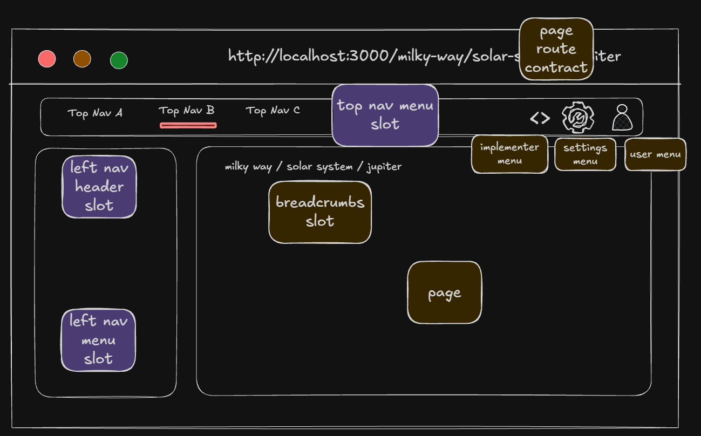

# UI Surface Contract

The Voyzu platform has the concept of a UI Surface. This conceptualises the web browser display as a number of slots. Packages can interact with these slots by declaring that they provide content into a given slot in their `voyzu.package.ts` file.

Navigation references page identifiers from the [Page routing contract](./page-routing-contract.md). Route definitions supply breadcrumbs; packages contribute only to the three navigation slots below.

A high level diagram of the UI surface with slots marked in purple:



### Slots

- topnav.menu

- leftnav.header

- leftnav.menu


## Declaring and supplying Slot content

Packages declare content to fill UI Surface slots in their root voyzu.package.ts file, using `contracts.uiSurface`.

By convention slot content resides in a package's top level `ui-surface` folder

## Examples


```ts
// voyzu.package.ts

import financeLeftNav from "./ui-surface/finance.left-nav";

export default {
  contracts: {
    uiSurface: {
      // Add a top-menu destination; its route determines the selected root.
      "topnav.menu": {
        finance: {
          label: "Finance",
          routeId: "finance.journals.list",
        },
      },
      // Supply the menu for pages declared under this package-owned root.
      // The sidebar appears when a root has menu items or a header.
      // Omit both leftnav slots to keep the top navigation without a sidebar.
      "leftnav.menu": {
        "/finance": { content: financeLeftNav },
      },
      // Place a package component above the menu.
      "leftnav.header": {
        "/finance": {
          loadComponent: () => import("./ui-surface/left-nav-header")
            .then(module => module.default),
        },
      },
    },
  },
};
```

```ts
// ui-surface/finance.left-nav.ts

export default [
  {
    // A heading groups related menu items.
    label: "Accounting",
    // Object keys identify menu items independently of their labels.
    items: {
      "finance.general-ledger": {
        label: "General Ledger",
        icon: "account_balance",
        // A parent item groups child destinations in a submenu.
        children: {
          "finance.journal-entries": {
            label: "Journal Entries",
            routeId: "finance.journals.list",
          },
          "finance.account-activity": {
            label: "Account Activity",
            routeId: "finance.account-activity.list",
          },
        },
      },
      "finance.financial-periods": {
        label: "Financial Periods",
        icon: "calendar_month",
        routeId: "finance.financial-periods.list",
      },
    },
  },
  {
    label: "Operations",
    items: {
      "finance.accounts-receivable": {
        label: "Accounts Receivable",
        icon: "receipt_long",
        children: {
          "finance.ar-invoices": {
            label: "Invoices",
            routeId: "finance.invoices.list",
          },
          "finance.ar-counterparties": {
            label: "Counterparties",
            routeId: "finance.ar-counterparties.list",
          },
        },
      },
    },
  },
];
```

```tsx
// ui-surface/left-nav-header.tsx

"use client";

import { FinanceCompanySwitcher } from "@voyzu/finance/organization-finance/client";

export default function FinanceLeftNavHeader({
  // Adapt the company selector to the platform's navigation layout.
  presentation,
}: {
  presentation: "expanded" | "collapsed" | "mobile";
}) {
  return (
    <FinanceCompanySwitcher
      companyPath="/finance/journals"
      isCollapsed={presentation === "collapsed"}
    />
  );
}
```


## Navigation selection

Each top-navigation item maps to a page-routing root. All pages declared under that root select its top-navigation item, left menu and header—even pages absent from the menu. For example, `/finance/journals/JNL-001` selects Finance because its route belongs to `pageRouting.roots["/finance"]`. No separate list of route IDs is needed.

## Ownership and ordering

A package supplies its own left menu and header. Their keys must be roots declared in that package's page-routing contract. Packages cannot contribute to another package's navigation. Each root has at most one top-menu item and one header. Top-menu destinations and menu links reference pages owned by the contributing package.

Menu items and nested children are objects keyed by stable identifiers; groups remain an array. An item declares exactly one of `routeId`, `path` or `children`. Use `routeId` for registered pages and `path` for placeholder destinations within a package-owned root. A placeholder does not require or register a page. Keys must be unique within a root's menu. Top-menu keys are unique across packages. Declaration order controls items and groups; Package Management controls package navigation order and visibility.

## Settings menu

The platform's Settings menu is the shared exception. Packages may contribute to `leftnav.menu["/settings"]` without declaring a top-menu item. This target applies to child roots such as `/settings/users`. A menu targeting the selected page's more specific, package-owned root takes precedence over the shared menu. Settings contributions with the same group label combine in package navigation order; an omitted label means "Settings".

```ts
// Inside contracts.uiSurface, for a package that owns the referenced page.
"leftnav.menu": {
  "/settings": {
    content: [{
      label: "Settings",
      items: {
        "auth.users": { label: "Users", routeId: "voyzu.users.page.list" },
      },
    }],
  },
},
```

## Header loading

Header loaders directly import a module under `./ui-surface/` and select its default or named component export with `.then(module => module.default)` or `.then(module => module.Header)`. Export that module through the package's matching `./ui-surface/...` path in `package.json`. Loaders do not capture variables or perform other work; composition generates browser-safe lazy imports without invoking the loaders or importing page and server implementations into the browser.

The platform supplies `presentation` as `"expanded"`, `"collapsed"` or `"mobile"`. The same component serves the desktop left navigation and mobile drawer. Unframed pages omit these slots.

## Composition

Composition reads `contracts.uiSurface` from each package's `voyzu.package.ts`, validates identifiers, route references, root ownership, contribution shapes and header loaders, and generates navigation and header registries. Slot files are imported by the package contract; exporting a file alone does not register a contribution.

Use `npm run voyzu:compose -- --routing-only` to refresh these registries. The platform retains control of branding, user controls, help, breadcrumbs and the page frame. Package visibility and page authorization remain enforced by the existing surface engine.
